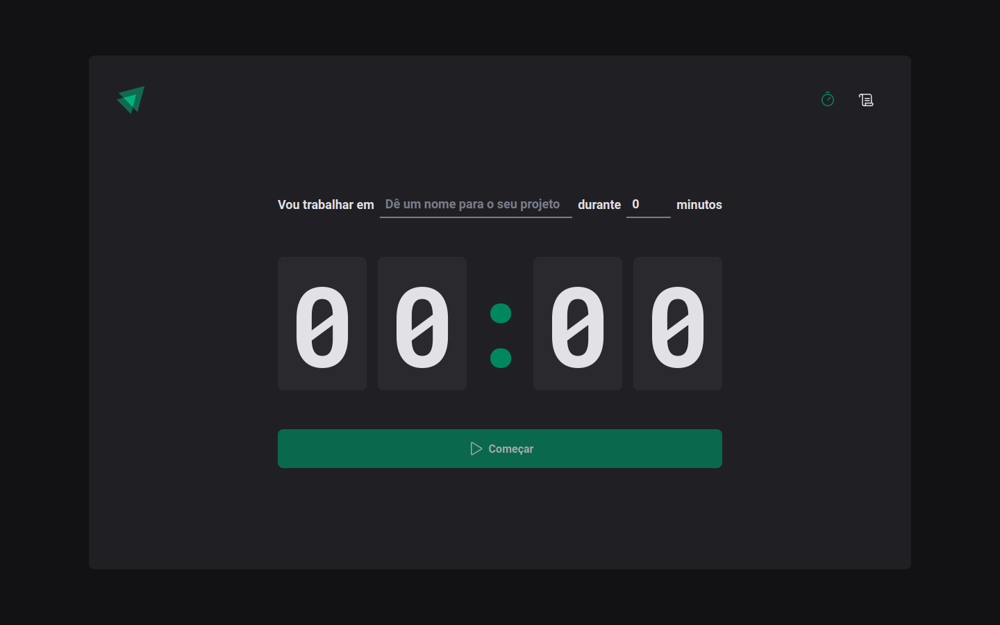

# <h1 align="center"> Ignite Timer </h1>

 Aplicação desenvolvida por mim durante o segundo módulo de ReactJs (Fundamentos) do Ignite da Rocketseat.   Essa aplicação consiste em app de pomodoro que consegue salvar no localstorage os pomodoros que o usuário ja fez 

  

## Stack utilizada

- ReactJS (Vite)
- Styled Components
- Zod + React Hook Form
- Typescript

## Conteúdos abordados

- Utilização de _css in js_ com styled components;
- Roteamento de telas;
- Uso de hooks do React, como useEffect e useReducer;
- Criação de contextos e utilização na aplicação;
- Validação de formulários com React Hook Form e Zod;

## Referência

- [Rocketseat](https://app.rocketseat.com.br/)
